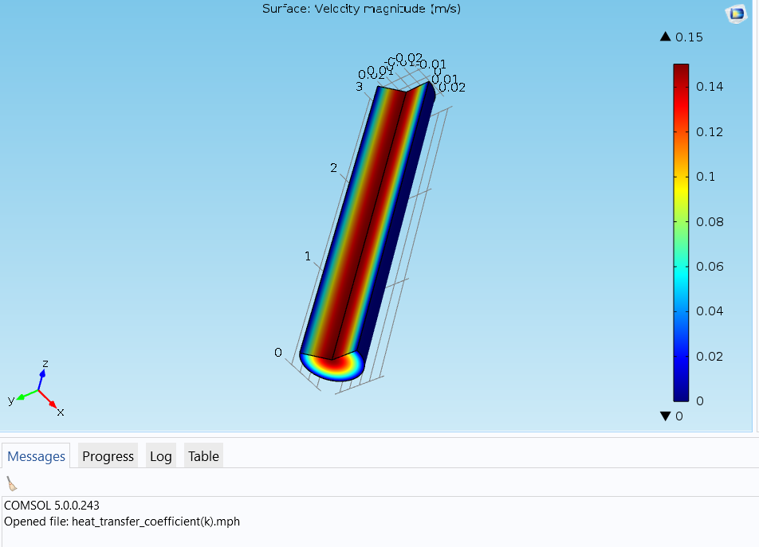
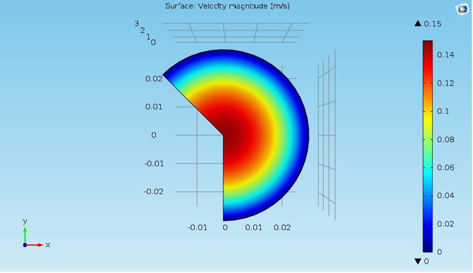
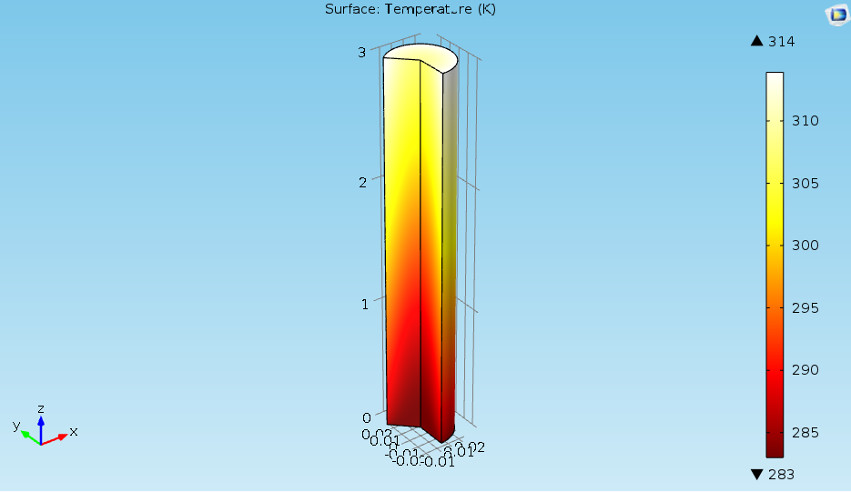
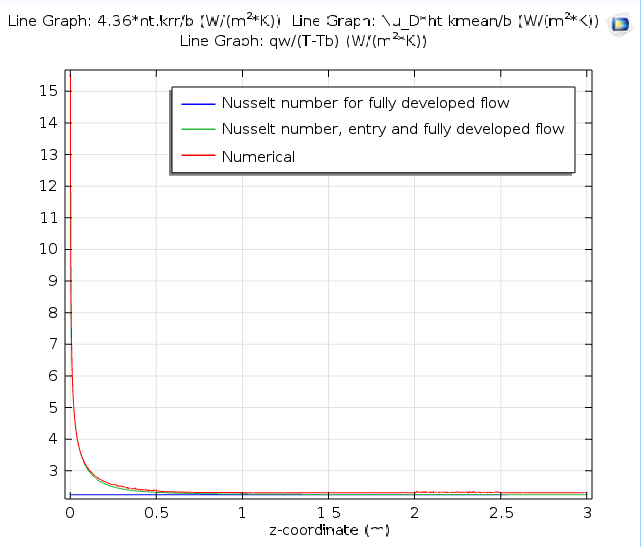

# 🔥 Laminar Flow Heat Transfer in a Circular Tube – COMSOL Multiphysics® 5.x

**COMSOL FEM | CFD | Heat Transfer | Thermal-Hydraulic Analysis**

A comprehensive 2D axisymmetric simulation of laminar airflow through a heated/cooled circular tube, performed using COMSOL Multiphysics® version 5.x. This project evaluates the heat transfer coefficient using both numerical computation and theoretical Nusselt number correlations (Graetz problem solution).

---

## 📋 Project Overview

This repository contains a complete COMSOL model that solves coupled fluid flow and heat transfer equations (conjugate heat transfer) for laminar flow in a pipe with constant wall heat flux or constant wall temperature. The model demonstrates thermal entrance region behavior and validates numerical results against classical correlations.

---

## 📐 Geometry Parameters

| Parameter | Value | Description |
|-----------|-------|-------------|
| **L** | 3 m | Tube length |
| **b** | 0.05 m | Tube diameter (D) |

---

## ⚙️ Material Properties (Air)

| Property | Value | Unit |
|----------|-------|------|
| Thermal conductivity (k) | ~0.026 | W/(m·K) |
| Density (ρ) | ~1.2 | kg/m³ |
| Heat capacity (Cp) | ~1005 | J/(kg·K) |
| Dynamic viscosity (μ) | ~1.8e-5 | Pa·s |

> Properties are temperature-dependent in the full model; nominal values at 293K shown.

---

## 🧪 Boundary Conditions

| Boundary | Condition | Value |
|----------|-----------|-------|
| Inlet (z=0) | Fully developed velocity profile | `U = 1.5*U_av*(1-4*(r/b)^2)` |
| Inlet temperature | Fixed | 283 K |
| Tube wall | Heat flux **OR** Fixed temperature | `qw = 10 W/m²` **or** `Tw = 293 K` |
| Outlet (z=L) | Pressure outlet | 0 Pa (gauge) |
| Axis (r=0) | Symmetry | Axial symmetry |

---

## 📊 Key Variables & Derived Quantities

| Variable | Expression | Unit | Description |
|----------|------------|------|-------------|
| **U** | `1.5*U_av*(1-4*(r/b)^2)` | m/s | Inlet velocity profile (laminar, parabolic) |
| **Tb** | `integrate(comp1.at2(r,z,2*pi*r*w*T),r,0,b/2) / integrate(comp1.at2(r,z,2*pi*r*w),r,0,b/2)` | K | Bulk mean temperature |
| **Ub** | `integrate(comp1.at2(r,z,2*pi*r*w),r,0,b/2) / (pi*(b/2)^2)` | m/s | Bulk mean velocity |
| **Tc** | `comp1.at2(0,z,T)` | K | Centerline temperature |
| **Pr** | `ht.Cp*spf.mu/ht.kmean` | — | Prandtl number |
| **Re_D** | `nitf1.rho*Ub*b/spf.mu` | — | Reynolds number |
| **Gz** | `b*Re_D*Pr/z * pi/4` | — | Graetz number (local) |
| **Nu_D** | `(1+(Gz/19.04/((1+(Pr/0.0207)^2/3)^1/2*(1+(Gz/29.6)^2)^1/3))^(3/2))^(1/3)*4.364*(1+(Gz/29.6)^2)^(1/6)` | — | Local Nusselt number (Gnielinski correlation for thermal entrance) |

---

## 📊 Results & Visualization

### 1. COMSOL Model Interface

*Figure 1: COMSOL Multiphysics interface showing the 2D axisymmetric model geometry, mesh, and solution setup for laminar tube flow heat transfer.*

---

### 2. Velocity Field (2D Axisymmetric)

*Figure 2: Surface plot of velocity magnitude (m/s) in the xy-plane cross-section. The parabolic profile characteristic of fully developed laminar flow is clearly visible, with maximum velocity (~0.15 m/s) at the centerline and zero velocity at the walls.*

**Key observations:**
- Fully developed velocity profile establishes within a short entrance length
- Maximum velocity occurs at r = 0 (centerline)
- No-slip condition satisfied at tube walls (r = b/2)
- Axisymmetric nature captured correctly

---

### 3. Temperature Distribution

*Figure 3: Surface plot of temperature distribution (K) along the tube length. The color gradient shows thermal development from inlet temperature (283 K, dark blue) to higher temperatures (up to 314 K, red) due to wall heating.*

**Key observations:**
- Thermal boundary layer develops from the inlet
- Gradual heating of bulk fluid along flow direction
- Radial temperature gradient steepest near the wall
- Nearly linear temperature rise in fully developed region

---

### 4. Developing and Fully Developed Flow Analysis

*Figure 4: Theoretical framework for Nusselt number correlation in developing and fully developed laminar tube flow. The Gnielinski correlation accounts for both entrance effects and fully developed asymptotic behavior.*

The local Nusselt number for the thermal entrance region is given by:

$$
\frac{\text{Nu}_1}{4.364 \left[ 1 + \left( \frac{\text{Gz}}{29.6} \right)^{2/3} \right]^{1/6}} = \left[ 1 + \left( \frac{\text{Gz}/19.04}{\left[ 1 + \left( \frac{\text{Pr}}{0.0207} \right)^{2/3} \right]^{1/2} \left[ 1 + \left( \frac{\text{Gz}}{29.6} \right)^{2/3} \right]} \right) \right]^{3/2}
$$

where Pr is the Prandtl number, and the Graetz number Gz is defined by:

$$
\text{Gz} = \frac{\pi}{4} \cdot \frac{\text{Re}_b \cdot \text{Pr} \cdot b}{z}
$$

with Re_b the Reynolds number associated with the tube diameter b.

---

### 5. Heat Transfer Coefficient Validation

*Figure 5: Line graph comparing different methods for determining the local heat transfer coefficient along the tube length:*

| Line | Description |
|------|-------------|
| 🔵 **4.36*k/b** | Fully developed flow assumption (constant Nu = 4.36) |
| 🟢 **kmean/b** | Entry region Nusselt number correlation |
| 🔴 **qw/(T-Tb)** | Numerical solution from COMSOL |

**Key observations:**
- At the inlet (z = 0), the numerical solution shows very high h(z) due to thin thermal boundary layer
- All three methods converge to the same asymptotic value (4.36·k/b) in the fully developed region (z > 1.5 m)
- Excellent agreement between the numerical solution and the entry region correlation
- Entrance length ~ 0.5–1.0 m for these flow conditions

---

### 6. Fully Developed Flow Nusselt Number

*Figure 6: Theoretical foundation for fully developed laminar flow heat transfer. For a tube with uniform surface heat flux, the Nusselt number approaches a constant value of 4.36 in the thermally fully developed region.*

**Formula:**
$$
\text{Nu}_c = \frac{h D_h}{k}
$$

**For tube with uniform surface heat flux:** `Nu = 4.36` (constant)

This asymptotic value serves as the validation benchmark for numerical simulations in the downstream region where thermal profiles become fully developed.

---

## 🔬 Physics Interpretation

**Governing equations solved:**
- Navier-Stokes (steady, laminar, incompressible)
- Continuity equation
- Energy equation: `ρ Cp (u·∇T) = ∇·(k ∇T)`

**Heat transfer mechanisms:**
- **Convection** dominates in the core flow
- **Conduction** dominates near the wall (thermal boundary layer)
- Bulk temperature rise due to wall heat flux or temperature difference

**Validation approach:**
- Compare numerically computed `h(z) = qw/(Tw - Tb(z))` with correlation-based Nusselt number

**Entrance vs. Fully Developed Regions:**

| Region | Characteristics | Nu_D behavior |
|--------|-----------------|---------------|
| **Entrance (z < 0.5 m)** | Thin thermal boundary layer, steep temperature gradient | Very high (> 10) |
| **Transition (0.5 < z < 1.5 m)** | Boundary layer grows, temperature gradient decreases | Decreasing from ~10 to ~4.36 |
| **Fully Developed (z > 1.5 m)** | Temperature profile shape constant, increases linearly with z | Constant = 4.36 |

---

## 🔬 Real-World Applications

### Application 1: Heat Exchanger Design

**Problem:** Shell-and-tube heat exchangers require accurate predictions of outlet temperatures and pressure drop.

**How this simulation applies:**
- Inlet (283K) → cold fluid entering
- Wall heating (qw or Tw) → hot utility side
- Tb(z) determines required tube length for target outlet temperature

**Impact:** Reduces overdesign by 15–25%, saving material costs.

### Application 2: Electronics Cooling with Liquid Flow

**Problem:** Cold plates for IGBTs or CPUs must remove heat efficiently without hotspots.

**How this simulation applies:**
- Tube → cooling channel in cold plate
- Wall heat flux → heat from electronic component
- Laminar flow → typical in compact cooling loops

**Impact:** Predicts maximum component temperature, preventing thermal failure.

### Application 3: Chemical Reactor Temperature Control

**Problem:** Tubular reactors require maintaining specific temperature profiles for optimal reaction rates.

**How this simulation applies:**
- Wall temperature boundary → cooling/heating jacket
- Bulk temperature profile → reaction rate distribution
- Entrance effects → localized hotspots

**Impact:** Prevents thermal runaway and improves product yield.

---

## 📁 Repository Contents
