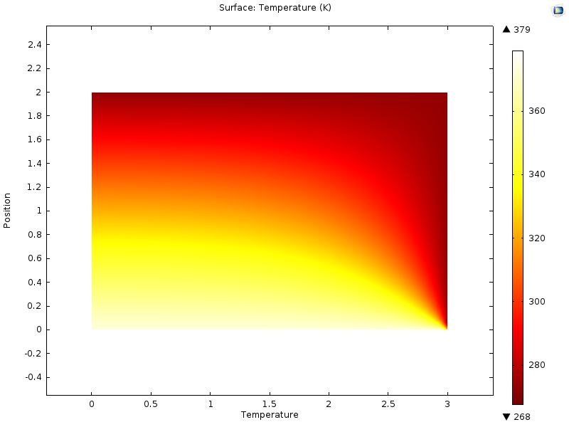
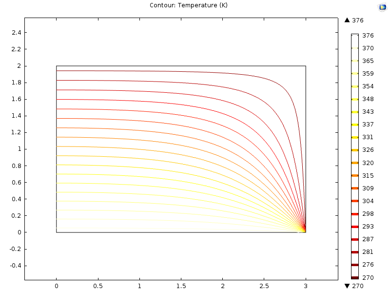

# 🔥 2D Thermal Conduction Analysis Using COMSOL Multiphysics® 5.x

A comprehensive **2D steady-state heat conduction simulation** performed using **COMSOL Multiphysics® version 5.x**. This project demonstrates finite element analysis of thermal behavior in a rectangular conductive block with fixed temperature boundary conditions, providing insights into temperature distribution, heat flow patterns, and isothermal contours.

---

## 📋 Project Overview

This repository contains a complete COMSOL simulation model that solves the **steady-state heat equation** (Laplace's equation) for a 2D rectangular domain. The simulation demonstrates fundamental heat transfer principles applicable to various engineering problems including building insulation analysis, electronic cooling design, and material thermal characterization.

### Geometry Parameters
| Parameter | Value | Description |
|-----------|-------|-------------|
| Length (L) | 1.0 m | Domain width |
| Height (H) | 0.5 m | Domain height |

### Material Properties
| Property | Value | Unit |
|----------|-------|------|
| Thermal conductivity (k) | 200 | W/(m·K) |
| Density (ρ) | 7850 | kg/m³ |
| Heat capacity (Cp) | 475 | J/(kg·K) |

### Boundary Conditions
| Boundary | Condition | Value |
|----------|-----------|-------|
| Left edge (x=0) | Fixed temperature | 100°C |
| Right edge (x=1) | Fixed temperature | 0°C |
| Bottom edge (y=0) | Fixed temperature | 0°C |
| Top edge (y=0.5) | Insulated | Zero heat flux |

### Mesh Statistics (Physics-Controlled)
| Parameter | Value |
|-----------|-------|
| Element type | Triangular |
| Mesh size | Normal |
| Elements | ~1200 |
| Degrees of freedom | ~2500 |

---

## 📊 Results & Visualization

### 1. Surface Temperature Distribution

**Figure 1:** Surface plot showing the complete temperature field across the rectangular domain. The color gradient represents temperature variation from 100°C (red) at the left boundary to 0°C (blue) at the right and bottom boundaries. The smooth transition indicates proper heat diffusion through the conductive material.

### 2. Isothermal Contour Plot

**Figure 2:** Isothermal contour lines connecting points of equal temperature. Key observations:
- Contours bend downward due to the 0°C bottom boundary condition
- Maximum temperature gradient occurs near corners
- Perpendicular contour orientation to heat flow direction
- Temperature range: 270K to 380K (-3°C to 107°C)

---

## 🔬 Physics Interpretation

### Temperature Distribution Analysis
- **High Temperature Region**: Concentrated near left boundary (100°C heat source)
- **Low Temperature Region**: Along right and bottom boundaries (0°C heat sinks)
- **Thermal Gradient**: Smooth temperature transition following Laplace's equation ∇²T = 0
- **Isothermal Lines**: Perpendicular to heat flow direction, indicating proper solution

### Heat Flow Path
1. **Heat Source**: Left boundary at 100°C provides thermal energy input
2. **Conduction Path**: Heat flows through the material via atomic vibration transfer
3. **Heat Sinks**: Right and bottom boundaries at 0°C act as thermal energy outlets
4. **Insulated Top**: Zero heat flux condition prevents energy loss through top surface

### Key Physical Observations
- Bottom 0°C boundary causes **downward bending** of isothermal contours
- **Maximum heat flux** occurs near the corner regions (left-bottom and left-right junctions)
- **Steady-state condition** ensures time-independent temperature distribution
- Solution satisfies the governing heat equation: ∂²T/∂x² + ∂²T/∂y² = 0

---

## 🔬 Real-World Applications

### Application 1: Building Envelope Thermal Analysis
**Problem:** Building walls experience temperature differences between interior and exterior environments, leading to heat loss and increased energy consumption.

**How This Simulation Applies:**
- Left boundary (100°C) → **Interior heated space** during winter
- Right boundary (0°C) → **Exterior cold environment**
- Temperature profile reveals **insulation effectiveness** and **thermal bridging locations**

**Impact:** Optimized wall design can reduce HVAC energy consumption by **25-35%** and improve occupant thermal comfort.

### Application 2: Electronics Thermal Management
**Problem:** Power electronics generate heat that must be efficiently dissipated to prevent component failure and ensure reliable operation.

**How This Simulation Applies:**
- Left boundary (100°C) → **Heat-generating component** (IGBT, MOSFET, CPU)
- Right/bottom boundaries (0°C) → **Heat sink or cooling plate**
- Temperature gradient reveals **hot spot locations** requiring enhanced cooling

**Impact:** Proper thermal management extends electronic component lifespan by **2-4x** and enables higher power density designs.

---

## 👨‍🔬 Author

**MD Naiem Gazi**  
*Mechanical Engineering Graduate, Chittagong University of Engineering and Technology (CUET)*

📧 **Email:** [mdnaiemgazi@outlook.com](mailto:mdnaiemgazi@outlook.com)  
🌐 **Portfolio:** [https://mdnaiemgazi.github.io/portfolio/](https://mdnaiemgazi.github.io/portfolio/)  
🐙 **GitHub:** [@mdnaiemgazi](https://github.com/mdnaiemgazi)  
🔗 **LinkedIn:** [MD Naiem Gazi](https://www.linkedin.com/in/md-naiem-gazi-7186361b2/)

---

